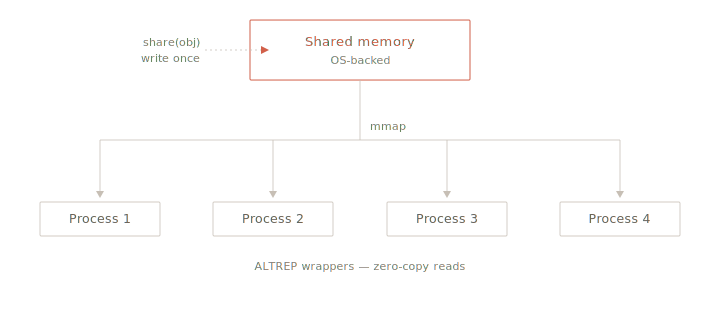

<!-- README.md is generated from README.Rmd. Please edit that file -->

```{r}
#| include: false
knitr::opts_chunk$set(
  collapse = TRUE,
  comment = "#>",
  fig.path = "man/figures/README-",
  out.width = "100%"
)
```

# mori <a href="https://shikokuchuo.net/mori/"></a>

<!-- badges: start -->
[](https://CRAN.R-project.org/package=mori)
[](https://github.com/shikokuchuo/mori/actions/workflows/R-CMD-check.yaml)
[](https://app.codecov.io/gh/shikokuchuo/mori)
<!-- badges: end -->

[](https://deepwiki.com/shikokuchuo/mori)

Shared Memory for R Objects

→ `share()` writes an R object into shared memory and returns a shared version

→ Compact ALTREP serialization — shared objects travel transparently through `serialize()` and `mirai()`

→ Lazy access and automatic cleanup — read on demand; freed by R's garbage collector

→ OS-level shared memory (POSIX / Win32) — pure C, no external dependencies

<br />

## Installation

``` r
install.packages("mori")
```

## Why mori

<a href="#why-mori"></a>

Parallel computing multiplies memory.
When 8 workers each need the same 200 MB dataset, that is 1.6 GB of serialization, transfer, and deserialization — with 8 separate copies consuming RAM.

`share()` writes the data into shared memory once and each worker maps the same physical pages — turning per-worker copies into per-worker references.

```{r}
#| label: bench-setup
library(mori)
library(mirai)
library(lobstr)

daemons(8)

# 200 MB data frame — 5 columns × 5M rows
df <- as.data.frame(matrix(rnorm(25e6), ncol = 5))
shared_df <- share(df)
```

Without mori, each worker holds the full data frame.
With mori, each worker holds a small reference into the shared memory region:

```{r}
#| label: bench-mem
mirai_map(1:8, \(i, data) format(lobstr::obj_size(data)),
          .args = list(data = df))[.flat] |> unique()

mirai_map(1:8, \(i, data) format(lobstr::obj_size(data)),
          .args = list(data = shared_df))[.flat] |> unique()
```

Avoiding 8 × 200 MB of serialize / deserialize also translates into a significant runtime saving:

```{r}
#| label: bench-time
boot_mean <- \(i, data) colMeans(data[sample(nrow(data), replace = TRUE), ])

# Without mori — each daemon deserializes a full copy
mirai_map(1:8, boot_mean, .args = list(data = df))[] |> system.time()

# With mori — each daemon maps the same shared memory
mirai_map(1:8, boot_mean, .args = list(data = shared_df))[] |> system.time()

daemons(0)
```

## Usage

Workers must run on the same machine as mori shares physical RAM.

### Sharing by name

`shared_name()` returns the shared memory name of a shared object.
`map_shared()` opens that region by name, which is useful for handing a reference between processes without going through serialization:

```{r}
#| label: by-name
x <- share(rnorm(1e6))

shared_name(x)
```
```{r}
# Another process can map the region by name
y <- map_shared(shared_name(x))
identical(x[], y[])
```

### Sharing through serialization

The ALTREP serialization hooks emit the same identifier on the wire, so the serialized form is a few bytes regardless of the data size:

```{r}
#| label: serialize
length(serialize(x, NULL))
```

This is transparent to any R serialization pathway: `mirai`, `parallel`, `callr`, and base R `serialize()` all carry shared objects as references rather than copies.

Sub-elements of a shared list serialize as references too.
In this case, each element travels as a path into the parent shared region, not as the full data:

```{r}
#| label: mirai-map
daemons(3)

# Share a list — all 3 vectors in a single shared region
lst <- share(list(a = rnorm(1e6), b = rnorm(1e6), c = rnorm(1e6)))

# Each element arrives on the worker as a zero-copy reference
mirai_map(lst, \(v) format(lobstr::obj_size(v)))[.flat] |> unique()

daemons(0)
```

## How It Works

### What gets shared

All atomic vector types and lists / data frames are written directly into shared memory, with attributes preserved end-to-end.
Pairlists are coerced to lists.
`share()` returns ALTREP wrappers that point into the shared memory region.
There is no deserialization and no per-process memory allocation.

All other R objects (environments, closures, language objects) are returned unchanged by `share()`, with no shared memory region created.

### Lazy access

A data frame lives in a single shared region.
Columns are read on demand, so a worker that needs 3 of 100 columns only loads 3.
Character strings are accessed lazily per element.

```{r}
#| label: lazy
df <- share(as.data.frame(matrix(rnorm(1e7), ncol = 100)))
shared_name(df)        # one region for all 100 columns
shared_name(df[[50]])  # sub-path into the same region
```

### Lifetime

Shared memory is managed by R's garbage collector.
The shared memory region stays alive as long as any shared object backed by it remains referenced in R — the original returned by `share()`, or a column or sub-list extracted from it, in this or another process.
When no references remain, or the session exits cleanly, the shared memory is freed automatically.

**Important:** Ensure the return value of `share()` is not garbage collected before a consumer can map its shared memory.

If a process is killed before cleanup can run (a crash, `SIGKILL`, or the OOM killer) its region can be left behind.
`prune_shared()` reclaims such orphans, removing only regions whose creating process is no longer running.

### Copy-on-write

Shared data is mapped read-only, preventing corruption of the shared region.
Mutations are always local — R's copy-on-write mechanism ensures other processes continue reading the original shared data:

- **Structural changes** to a list or data frame (adding, removing, or reordering elements) produce a regular R list.
  The shared region is unaffected.
- **Modifying values** within a shared vector (e.g., `X[1] <- 0`) materializes just that vector into a private copy.
  Other vectors in the same shared region stay zero-copy.

--

Please note that the mori project is released with a [Contributor Code of Conduct](https://shikokuchuo.net/mori/CODE_OF_CONDUCT.html).
By contributing to this project, you agree to abide by its terms.
